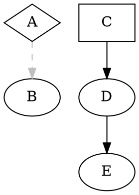

# this is hheader is changedeader 3this is wrong you know that added has changed

graphviz is something that  has to be
this is something has to change

```graphviz
digraph D {
  A [shape=diamond]
  C [shape=box]
  A -> B [style=dashed, color=grey]
  C -> D
  D -> E
}
```
rendererr3
werewr
